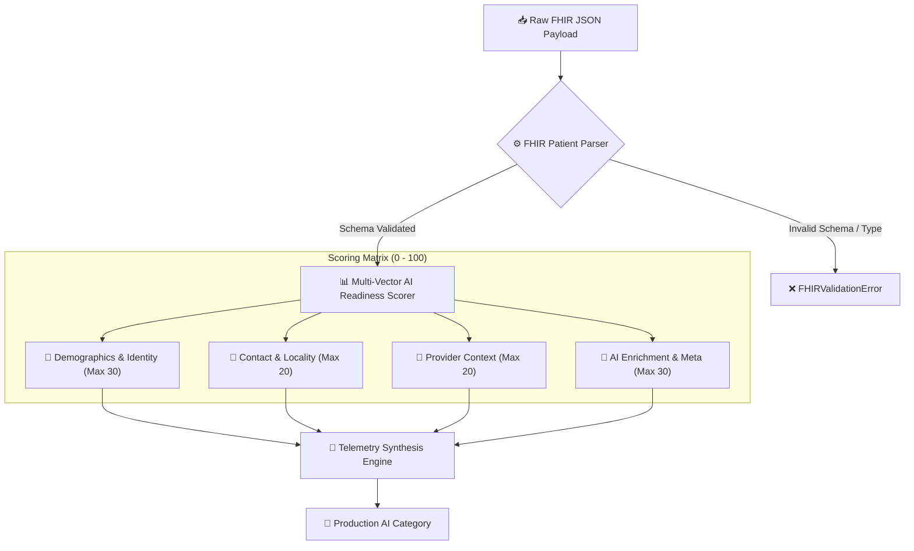

<div align="center">


# ⚡ CLINICAL EVAL DATA ENGINE ⚡
### Next-Gen FHIR Data Validation & Clinical AI Readiness Scoring

[](https://pypi.org/project/clineval-dataengine/)
[](https://github.com/eranyakulayash/clineval-dataengine/actions/workflows/test.yml)
[](https://hl7.org/fhir/R4/)
[](https://pypi.org/project/clineval-dataengine/)
[](LICENSE)

<p align="center">
  <b>High-Performance Data Validation</b> • <b>Multi-Vector AI Scoring</b> • <b>Production-Grade FHIR Telemetry</b>
</p>

---

</div>

## 🌌 Overview

**ClinEval DataEngine** (`clineval-dataengine`) is an ultra-fast, zero-dependency Python engine designed to parse, validate, and compute **Clinical AI Readiness Scores (0–100)** for HL7® FHIR® Patient data pipelines. 

Built for modern healthcare AI platforms, Large Language Models (LLMs), and predictive risk algorithms, ClinEval determines whether clinical dataset streams possess the structural integrity and demographic completeness needed for downstream AI model inference and training.

> [!IMPORTANT]
> Raw EHR data often lacks critical identifiers, timestamps, or coded extensions required for unbiased AI models. ClinEval acts as a real-time firewall for your data lake.

---

## 🔬 System Pipeline Architecture



---

## ⚡ Key Features

| Vector Domain | Max Points | Evaluation Parameters |
| :--- | :---: | :--- |
| **Core Demographics & Identity** | `30` | Valid Patient ID, Full Name Vectors (family/given), Gender & ISO `birthDate` |
| **Contact & Locality Vector** | `20` | Unique MRN/National Identifiers, Telecommunication endpoints, Postal/Geographic context |
| **Provider & Organizational Context** | `20` | Active patient lifecycle status, Assigned General Practitioner, Managing Organization |
| **AI Enrichment & Metadata** | `30` | Language/Communication attributes, Race/Ethnicity extensions, Meta timestamps |

---

## 🚀 Quickstart

### 1. Installation

```bash
pip install clineval-dataengine
```

### 2. High-Performance Evaluation

```python
from clineval_dataengine import FHIRPatientParser, FHIRValidationError

# Initialize parser engine
parser = FHIRPatientParser()

# Sample FHIR Patient Resource
payload = {
    "resourceType": "Patient",
    "id": "pat-1001",
    "meta": {"versionId": "1", "lastUpdated": "2026-08-01T10:00:00Z"},
    "active": True,
    "identifier": [{"system": "urn:oid:1.2.3.4", "value": "MRN-987654"}],
    "name": [{"use": "official", "family": "Smith", "given": ["Jane", "Alice"]}],
    "telecom": [{"system": "phone", "value": "555-0199"}],
    "gender": "female",
    "birthDate": "1985-04-12",
    "address": [{"city": "Boston", "state": "MA", "postalCode": "02115"}],
    "communication": [{"language": {"coding": [{"code": "en"}]}}],
    "generalPractitioner": [{"reference": "Practitioner/pr-55"}],
    "managingOrganization": [{"reference": "Organization/org-01"}],
    "extension": [{"url": "http://hl7.org/fhir/us/core/us-core-race", "valueString": "Asian"}]
}

# Parse and calculate AI Readiness Telemetry
try:
    record = parser.parse_json(payload)
    telemetry = parser.calculate_ai_readiness_score(record)
    
    print(f"Score: {telemetry['score']}/100")
    print(f"Status: {telemetry['readiness_category']}")
    print(f"Breakdown: {telemetry['breakdown']}")
except FHIRValidationError as err:
    print(f"Validation Failure: {err}")
```

---

## 🖥️ Terminal Telemetry Output

```text
================================================================================
 ⚡ CLINICAL EVAL DATAENGINE TELEMETRY RESULT ⚡
================================================================================
  ► RECORD ID          : pat-1001
  ► VALIDATION STATUS  : PASSED [HL7 FHIR R4]
  ► AI READINESS SCORE : 100.0 / 100.0
  ► READINESS STATUS   : Production AI Ready

  📊 DOMAIN SCORE BREAKDOWN
  ├─ Demographics      : [####################] 30.0 / 30
  ├─ Contact & Location: [####################] 20.0 / 20
  ├─ Provider Context  : [####################] 20.0 / 20
  └─ AI Enrichment Meta: [####################] 30.0 / 30
================================================================================
```

---

## 🧪 Local Testing & Verification

Run the built-in validation suite using `pytest`:

```bash
git clone https://github.com/eranyakulayash/clineval-dataengine.git
cd clineval-dataengine
pip install -e .[dev]
pytest
```

> [!TIP]
> Use `python test_local.py` for a standalone execution pass without external test runner overhead.

---

## 📜 License

Distributed under the **MIT License**. See `LICENSE` for details.

<div align="center">
  <sub>Built with precision by <b>EranyaKula yash</b> and the <b>ClinEval DataEngine Core Team</b>.</sub>
</div>
